<div align="center">
<h1> Stratified layering for soil profile: Dynamic short field Mamba network </h1>

[Shaohua Zeng]()<sup>1,2,†</sup>, [Zhihao Chen]()<sup>1,2,†</sup>, [Ruolan Zeng]()<sup>3</sup>, [Shuai Wang]()<sup>4</sup>, [Yang Wang]()<sup>5</sup>

<sup>1</sup> College of Computer & Information Science, Chongqing Normal University, Chongqing 401331, China  
<sup>2</sup> Chongqing Centre of Engineering Technology Research on Digital Agricultural & Service, Chongqing 401331, China  
<sup>3</sup> Chongqing Electric Power College, Chongqing 400053, China  
<sup>4</sup> Chongqing Master Station of Agricultural Technology Promotion, Chongqing 401121, China  
<sup>5</sup> Jiangjin District Agricultural Technology Promotion Center, Chongqing 404799, China  
<sup>†</sup> Equal contribution  

[](https://arxiv.org/abs/2404.04256) 
[](https://opensource.org/licenses/MIT) 
[](https://x.com/_akhaliq/status/1777272323504025769)

</div>


## 👀Introduction

This repository contains the code for our paper  
**Stratified layering for soil profile: Dynamic short field Mamba network**.  
[[Paper](https://arxiv.org/abs/2404.04256)]

---

### 📌 Technical Overview

- **Technical implementation route**  
  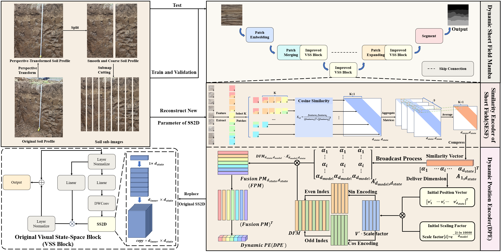

- **Soil profile preprocessing(vertical sub-image segmentation process)**  
  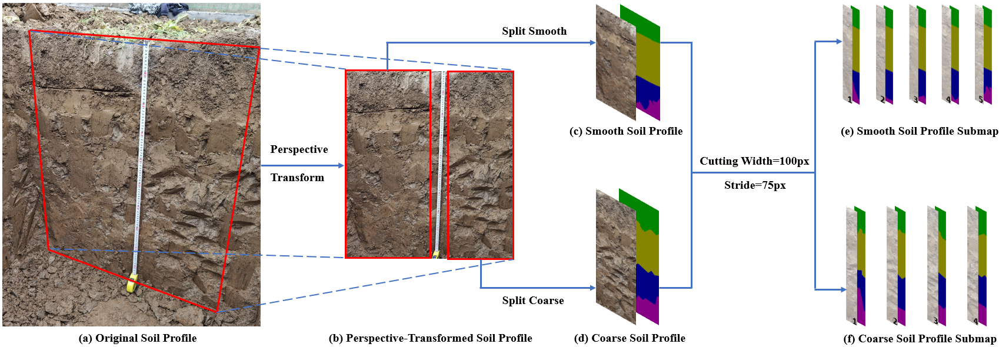

- **Baseline VM-UNet network**  
  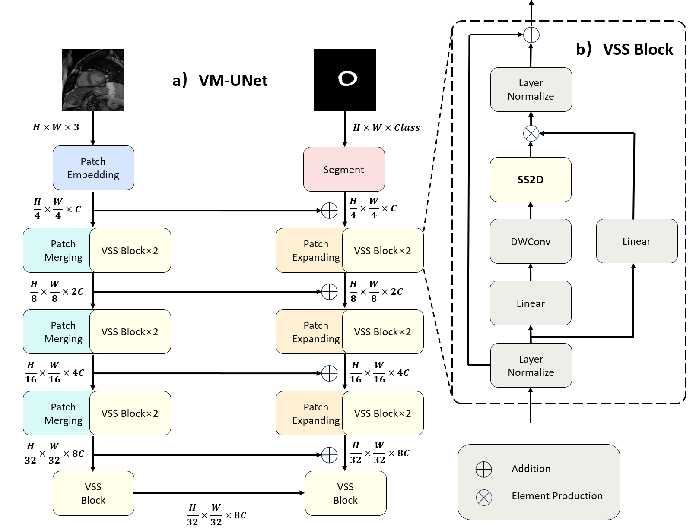

- **Network structure: DSFM**  
  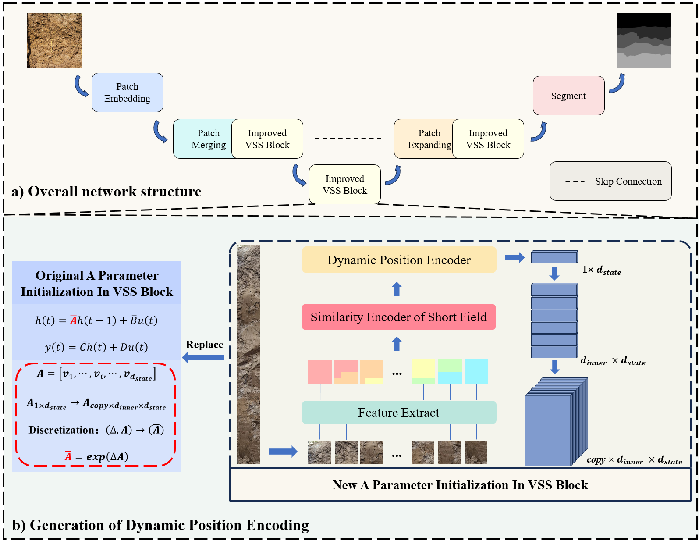

- **Modules in DSFM:**  
  - Similarity Encoder of Short Field Module(SESF)  
    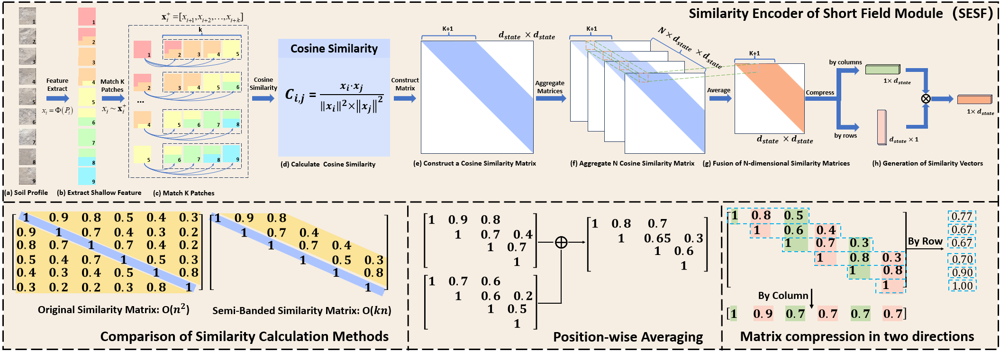  
  - Dynamic Position Encoder Module(DPE) 
    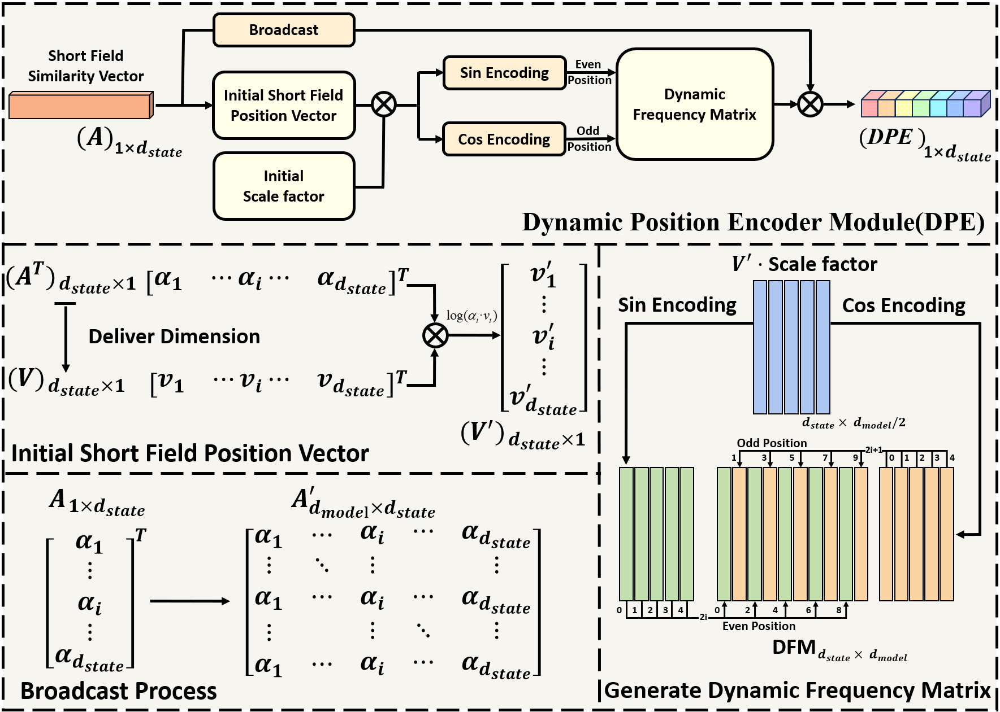

---

### 📊 Performance and Comparison

- **Accuracy Comparison on Full-size Soil Profile Datasets vs Sub-image Soil Profile Datasets(VM-UNet)**  
  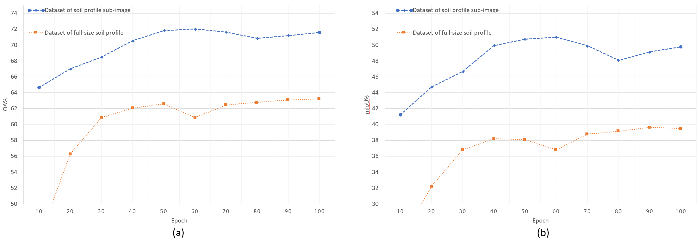

- **Accuracy Across Sub-image Sizes(DSFM)**  
  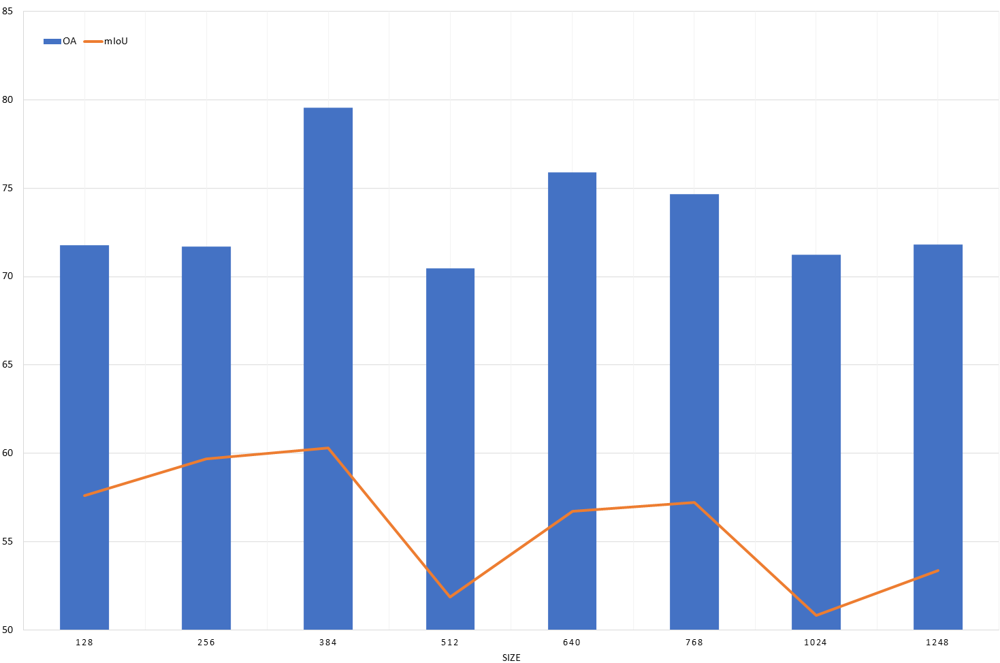

- **Accuracy Comparison under Different K Parameters (DSFM)**  
  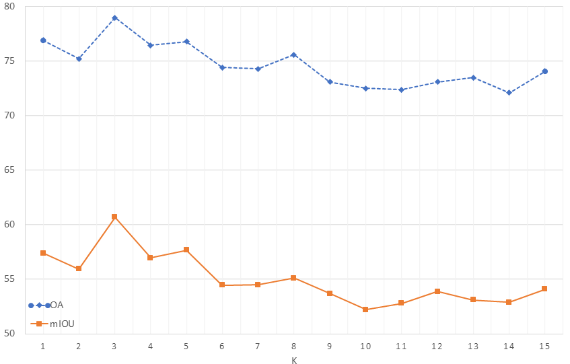

- **Segmentation results comparing DSFM network with mainstream networks**  
  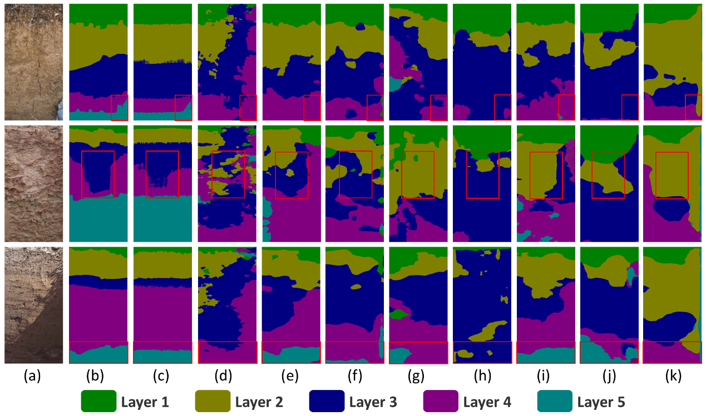

  *(a) Soil profile image. (b) Ground truth. (c) DSFM network. (d) Swin-Transformer. (e) Twins. (f) ViT. (g) ConvNeXt. (h) DeepLabV3. (i) SegFormer. (j) ResNeSt. (k) Fast-SCNN.)*


- **Test Accuracy Curves**  
  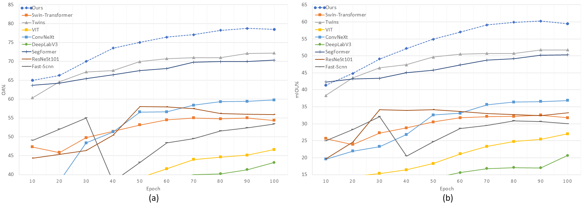  


- **Ablation Results**
  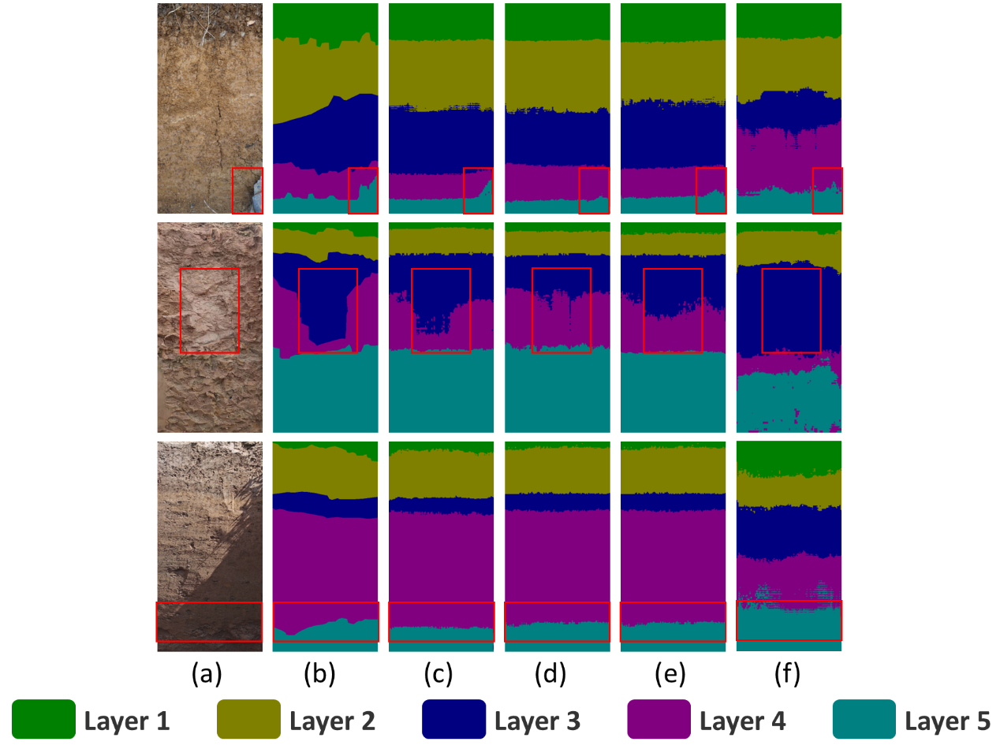

  *(a) Soil profile. (b) Ground truth. (c) DSFM network. (d) VM-UNet + SESF. (e) VM-UNet + DPE. (f) VM-UNet.*

- **Test Accuracy Curves**  
  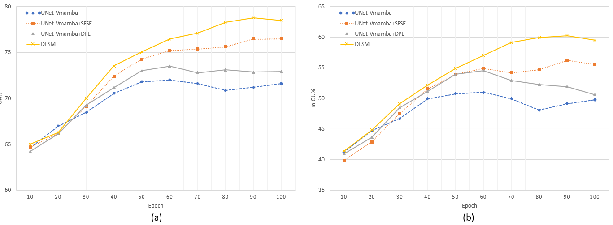


## 💡Environment

We test our codebase with `PyTorch 1.13.1 + CUDA 11.7` as well as `PyTorch 2.2.1 + CUDA 12.1`. Please install corresponding PyTorch and CUDA versions according to your computational resources. We showcase the environment creating process with PyTorch 1.13.1 as follows.

1. Create environment.
    ```shell
    conda create -n soma python=3.9
    conda activate soma
    ```

2. Install all dependencies.
Install pytorch, cuda and cudnn, then install other dependencies via:
    ```shell
    pip install torch==1.13.1+cu117 torchvision==0.14.1+cu117 torchaudio==0.13.1 --extra-index-url https://download.pytorch.org/whl/cu117
    ```
    ```shell
    pip install -r requirements.txt
    ```

3. Install Mamba
    ```shell
    cd models/encoders/selective_scan && pip install . && cd ../../..
    ```

## ⏳Setup

### Datasets

1. We use Two datasets, including both Surface Soil and Soil Profile datasets:
    - [Surface Soil](Data Privacy)
    - [Soil Profile](Data Privacy)

2. If you are using your own datasets, please organize the dataset folder in the following structure:

    ```shell
    <data>
    |-- cutting
    |   |-- images
    |   |   |-- <name1>.<ImageFormat>
    |   |   |-- <name2>.<ImageFormat>
    |   |   ...
    |   |-- masks  # Grayscale segmentation masks
    |       |-- <name1>.<LabelFormat>
    |       |-- <name2>.<LabelFormat>
    |       ...
    |-- entire_img
    |   |-- images
    |   |   |-- <name1>.<ImageFormat>
    |   |   |-- <name2>.<ImageFormat>
    |   |   ...
    |   |-- masks  # Grayscale segmentation masks
    |       |-- <name1>.<LabelFormat>
    |       |-- <name2>.<LabelFormat>
    |       ...
    |-- mix
    |   |-- images
    |   |   |-- <name1>.<ImageFormat>
    |   |   |-- <name2>.<ImageFormat>
    |   |   ...
    |   |-- masks  # Grayscale segmentation masks
    |       |-- <name1>.<LabelFormat>
    |       |-- <name2>.<LabelFormat>
    |       ...
    ```

📌 **Note:**  
- **All masks must be in grayscale format (single-channel).**  
- **Recommended formats:** `.png`, `.jpg`, `.tif` for images, and `.png` or `.tif` for masks.  
- **Ensure masks are properly labeled with distinct grayscale values representing different classes.**

## 📦Usage

### Training  
1. This model requires a pre-trained ResNet checkpoint. Please download it from [ResNet](https://pytorch.org/vision/stable/models.html#id2).  

    🔗 [Torchvision Official Pretrained Model](https://pytorch.org/vision/stable/models.html#id2)  
   
    📥 **Directly Download ResNet-50 Weight**：  
    - [resnet50-11ad3fa6.pth](https://download.pytorch.org/models/resnet50-11ad3fa6.pth)  

    <u> Please put them under `model/short_range_vmamba_unet/`. </u>  

2. **Start Training**  
    Run the following command to start training:  
    ```bash
    python train_vmamba_cutting_pre_entire.py
    ```
    This script will launch the training process with default configurations.  

3. **Other Training Modes**  
    If you want to experiment with different training approaches, you can run other training scripts in the repository.  
    Example:  
    ```bash
    python train_vmamba_entire_pre_entire.py
    ```
    Modify the script parameters as needed to customize the training process.

4. Results will be saved in `logs` folder and `model_pth` folder.

5. Testing and Visualization  

    After training the model, you can perform inference on test images and visualize the results using the provided script.  
    
    ### **Run Inference on Test Data**  
    To test the trained model on the dataset, execute the following command:  
    ```bash
    python model/short_range_vmamba_unet/test.py
    ```
    
    ### **IoU Evaluation for Each Class**  
    The model also provides per-class IoU (Intersection over Union) evaluation to assess segmentation performance.
    To compute IoU for each class, run:
   ```bash
   python model/short_range_vmamba_unet/test_iou.py
    ```

    The visualization results will be automatically saved in the following folder:local_visualizations/


## 📈Results

We provide our result on the Soil Profile datasets:

---

### Table 1. Comparison table of mainstream algorithms

| Method           | Backbone       | OA (%) | mAcc (%) | mIoU (%) |
|------------------|----------------|--------|----------|----------|
| Swin-Transformer | Swin-T         | 55.36  | 45.72    | 32.52    |
| Twins            | Twins-SVT-S    | 72.26  | 65.63    | 51.73    |
| ViT              | ViT-B          | 46.64  | 40.64    | 26.99    |
| ConvNeXt         | ConvNeXt-T     | 59.78  | 50.85    | 36.82    |
| DeepLabV3        | ResNet50       | 43.21  | 34.16    | 20.61    |
| SegFormer        | MiT-B0         | 70.34  | 64.54    | 50.33    |
| ResNeSt          | ResNeSt-101    | 58.04  | 48.96    | 34.15    |
| Fast-SCNN        | Fast-SCNN      | 55.02  | 37.88    | 32.09    |
| **Ours**         | VMamba-T       | **78.99<sup>a</sup>** | **69.04** | **60.22** |

*a. The best experimental results are in bold.*

---

### Table 2. Accuracy and IoU comparison of DSFM and mainstream networks across soil layers

| Method           | Layer 1      |Layer 1 | Layer 2       |Layer 2        |Layer 3       |Layer 3        | Layer 4       |Layer 4        | Layer 5       |Layer 5        |
|------------------|--------------|--------|--------------|--------|--------------|--------|--------------|--------|--------------|--------|
|                  | Acc(%)         | IoU(%)    | Acc(%)            | IoU(%)    | Acc(%)            | IoU(%)    | Acc(%)         | IoU(%)    | Acc(%)         | IoU(%)    |
| Swin-Transformer | 40.4         | 38.9     | 55.6         | 44.1     | 68.7         | 40.8     | 61.6         | 36.6     | 2.1          | 2.1    |
| Twins            | **88.6<sup>1</sup>**     | **72.7<sup>2</sup>** | 71.2         | **56.9<sup>2</sup>** | 68.9         | **53.6<sup>2</sup>** | **77.8<sup>1</sup>**     | **57.8<sup>2</sup>** | **21.3<sup>2</sup>**     | **21.1<sup>2</sup>** |
| ViT              | 51.9         | 43.3     | 29.5         | 23.8     | 62.7         | 30.9     | 52.4         | 31.4     | 6.6          | 5.5    |
| ConvNeXt         | 64.9         | 53.2     | 59.0         | 42.8     | 62.8         | 41.0     | 62.2         | 42.5     | 5.1          | 4.2    |
| DeepLabV3        | 50.3         | 42.9     | 23.7         | 19.3     | **89.5<sup>1</sup>**     | 34.2     | 5.9          | 5.7      | 0.9          | 0.9    |
| SegFormer        | 74.8         | 67.1     | 72.7         | 55.3     | 66.2         | 50.3     | **75.6<sup>2</sup>**     | 53.3     | **33.3<sup>1</sup>**     | **25.6<sup>1</sup>** |
| ResNeSt-101      | 84.1         | 61.7     | 37.8         | 33.2     | **88.1<sup>2</sup>**     | 43.4     | 14.9         | 13.5     | 19.8         | 14.1   |
| Fast-SCNN        | 47.6         | 42.8     | **82.9<sup>1</sup>**     | 42.5     | 44.7         | 27.4     | 13.8         | 12.2     | 0.0          | 0.0    |
| **Ours**         | **86.0<sup>2</sup>**     | **78.2<sup>1</sup>** | **81.1<sup>2</sup>**     | **71.7<sup>1</sup>** | 81.7         | **68.2<sup>1</sup>** | 73.8         | **66.1<sup>1</sup>** | 22.6         | 16.9   |


*a. The best and second-best results for each layer are highlighted in 1 and 2.*

---

### Table 3. Comparison table of the ablation experiments

| VM-UNet | SESF | DPE | OA (%) | mIoU (%) |
|--------|------|-----|--------|----------|
| ✓      | ✗    | ✗   | 72.01  | 49.76    |
| ✓      | ✓    | ✗   | 76.53  | 55.57    |
| ✓      | ✗    | ✓   | 72.92  | 50.61    |
| ✓      | ✓    | ✓   | **78.99<sup>a</sup>** | **60.22** |

*a. The best experimental results are in bold.*

## 🙏Acknowledgements

Our Mamba codes are adapted from [Mamba](https://github.com/state-spaces/mamba) and [VMamba](https://github.com/MzeroMiko/VMamba). We thank the authors for releasing their code!

## 📧Contact

If you have any questions, please  contact at [Zhihao Chen](2023210516060@stu.cqnu.edu.cn).

## 📌 BibTeX & Citation

If you find this code useful, please consider citing our work:

```bibtex
@article{wan2024sigma,
  title={Stratified layering for soil profile: Dynamic short field Mamba network},
  author={Zeng, Shaohua and Chen, Zhihao and Yong, Silong and Zhang, Pingping and Stepputtis, Simon and Sycara, Katia and Xie, Yaqi},
  journal={arXiv preprint arXiv:2404.04256},
  year={2024}
}
```

